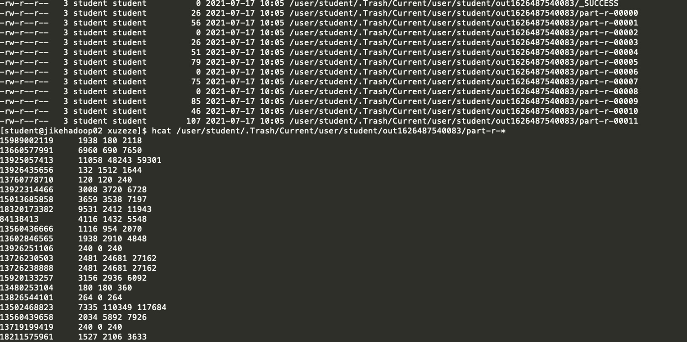

作业：
1.需求：
统计每一个手机号耗费的总上行流量、下行流量、总流量
2.数据准备：
(1)输入数据格式：
时间戳、电话号码、基站的物理地址、访问网址的ip、网站域名、数据包、接包数、上行/传流量、下行/载流量、响应码

(2)最终输出的数据格式：
手机号码		上行流量        下行流量		总流量

3.基本思路：
(1)Map阶段：
(a)读取一行数据，切分字段
(b)抽取手机号、上行流量、下行流量
(c)以手机号为key，bean对象为value输出，即context.write(手机号,bean);
(2)Reduce阶段：
(a)累加上行流量和下行流量得到总流量。
(b)实现自定义的bean来封装流量信息，并将bean作为map输出的key来传输
(c)MR程序在处理数据的过程中会对数据排序(map输出的kv对传输到reduce之前，会排序)，排序的依据是map输出的key
所以，我们如果要实现自己需要的排序规则，则可以考虑将排序因素放到key中，让key实现接口：WritableComparable。
然后重写key的compareTo方法。

4.程序代码：
(1)编写流量统计的bean对象FlowBean
FlowBean.java

package phoneData;

import org.apache.hadoop.io.Writable;
import java.io.DataInput;
import java.io.DataOutput;
import java.io.IOException;

// 1 实现writable接口
@Setter
@Getter
public class FlowBean implements Writable {
    //上传流量
    private long upFlow;
    //下载流量
    private long downFlow;
    //流量总和
    private long sumFlow;

    //必须要有，反序列化要调用空参构造器
    public FlowBean() {
    }

    public FlowBean(long upFlow, long downFlow) {
        this.upFlow = upFlow;
        this.downFlow = downFlow;
        this.sumFlow = upFlow + downFlow;
    }

    public void set(long upFlow, long downFlow){
        this.upFlow = upFlow;
        this.downFlow = downFlow;
        this.sumFlow = upFlow + downFlow;
    }


    /**
     * 序列化
     *
     * @param out
     * @throws IOException
     */
    @Override
    public void write(DataOutput out) throws IOException {
        out.writeLong(upFlow);
        out.writeLong(downFlow);
        out.writeLong(sumFlow);
    }

    /**
     * 反序列化
     * 注：字段属性顺序必须一致
     *
     * @param in
     * @throws IOException
     */
    @Override
    public void readFields(DataInput in) throws IOException {
        this.upFlow = in.readLong();
        this.downFlow = in.readLong();
        this.sumFlow = in.readLong();
    }
    @Override
    public String toString() {
        return upFlow + "\t" + downFlow + "\t" + sumFlow;
    }
}

答案：
**命令**
```shell
hadoop jar learn_hadoop-1.0-SNAPSHOT.jar com.reiser.mapr.Flow -Dmapreduce.job.reduces=1  /user/student/HTTP_20130313143750.dat /user/student/out
```

