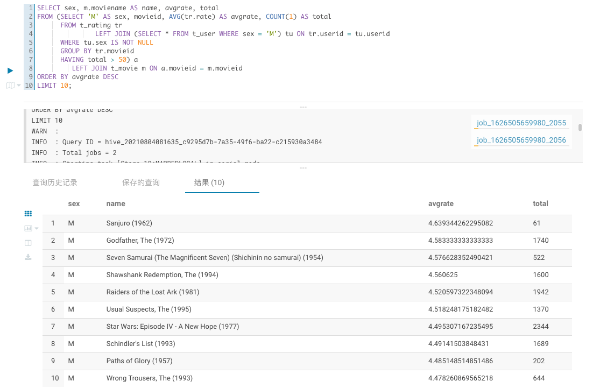
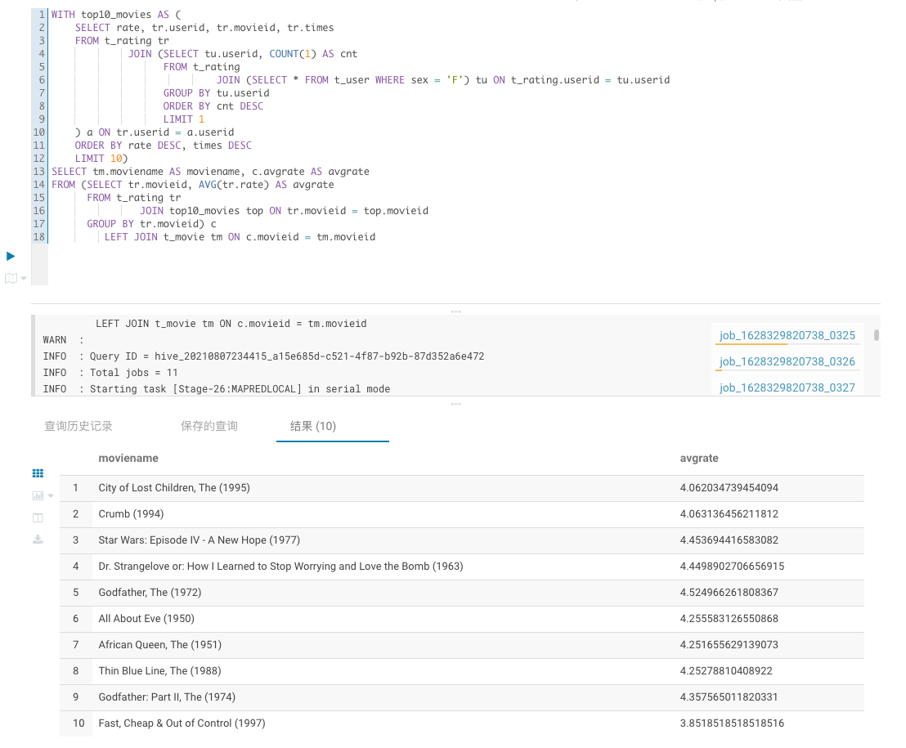

# Hive Sql 练习
## 素材准备
### t_movie
```sql
create table t_movie
(
	movieid bigint,
	moviename string,
	movietype string
);


```
[t_movie 数据准备](../../resource/t_movie.csv)
### t_rating
```sql
create  table t_rating
(
	userid bigint,
	movieid bigint,
	rate double,
	times string
);


```
[t_rating 数据准备](../../resource/t_rating.csv)
### t_user
```sql
CREATE TABLE t_user
(
    userid     bigint,
    sex        string,
    age        int,
    occupation string,
    zipcode    string
);
```
[t_user 数据准备](../../resource/t_user.csv)

## 题目一：

> 展示电影ID为2116这部电影各年龄段的平均影评分


### 我先思考
- 首先确定主表，既然是评分故选择 `t_rating` 
- `t_rating` 有电影ID和评分的信息，但是没有年龄信息
- 年龄信息通过 `t_user` 获得，并通过 `userid` 进行关联
- 通过使用 `GROUP BY` 将年龄分段，`AVG()` 获得平均平凡
- `ORDER BY` 让年龄从小到大展示

### Show Me Code
```sql
SELECT tu.age, AVG(tr.rate)
FROM t_rating tr
         LEFT JOIN t_user tu ON tr.userid = tu.userid
WHERE tr.movieid = 2116
GROUP BY tu.age
ORDER BY tu.age;
```

### 运行结果


## 题目二：

> 找出男性评分最高且评分次数超过50次的10部电影，展示电影名，平均影评分和评分次数

### 我先思考
- 通过 `t_rating left join userid` 将评分信息和用户信息进行关联
- 我们需要筛选出男性，可以先将 `t_user` 过滤出男性后再 `join`, 只有 `join` 上的表才为男性评分
- 获取评分最高的电影需要使用 `GROUP BY` 对电影进行分组，并求得评分的平均值（因为每部电影的评分数不一样所以不能用总评分）  
- 还要筛选评分次数超过50次的，这里需要使用 `HAVING total > 50`, `totol` 是在 `SELECT` 语句中通过函数 `COUNT(1) AS total` 获得的，这也展示了 `WHERE` 和 `HAVING` 的区别
  - `HAVING` 必须和 `GROUP BY` 配合使用
  - `WHERE` 只能过滤已有字段，`HAVING` 不仅能过滤已有字段，还能过滤计算后的字段
    - 对于已有字段，推荐先使用 `WHERE` 过滤，原因是因为优化机制 `WHERE` 会在扫描数据时就过滤掉无效的行
- 最后通过 `ORDER BY` 和 `LIMIT` 按平均分获取前十的电影

### Show Me Code
```sql
SELECT sex, m.moviename AS name, avgrate, total
FROM (SELECT 'M' AS sex, movieid, AVG(tr.rate) AS avgrate, COUNT(1) AS total
      FROM t_rating tr
                JOIN (SELECT * FROM t_user WHERE sex = 'M') tu ON tr.userid = tu.userid
      GROUP BY tr.movieid
      HAVING total > 50) a
         LEFT JOIN t_movie m ON a.movieid = m.movieid
ORDER BY avgrate DESC
LIMIT 10;
```

### 运行结果


## 题目三
> 找出影评次数最多的女士所给出最高分的10部电影的平均影评分，展示电影名和平均影评分（可使用多行SQL）

### 我先思考
- 如果能用 `join` 就不要用子查询
- 一步步拆解 SQL
  - 筛选女士
  - 影评次数最多
  - 最高分的10部电影
  - 平均影评分和电影名

### Show Me Code
```sql
WITH top10_movies AS (
  SELECT rate, tr.userid, tr.movieid, tr.times
  FROM t_rating tr
         JOIN (SELECT tu.userid, COUNT(1) AS cnt
               FROM t_rating
                      JOIN (SELECT * FROM t_user WHERE sex = 'F') tu ON t_rating.userid = tu.userid
               GROUP BY tu.userid
               ORDER BY cnt DESC
               LIMIT 1
  ) a ON tr.userid = a.userid
  ORDER BY rate DESC, times DESC LIMIT 10)
SELECT tm.moviename AS moviename, c.avgrate
FROM (SELECT tr.movieid, AVG(tr.rate) AS avgrate
      FROM t_rating tr
             JOIN top10_movies top ON tr.movieid = top.movieid
      GROUP BY tr.movieid) c
       LEFT JOIN t_movie tm ON c.movieid = tm.movieid
```
### 运行结果


基本SQL教程：
- https://www.w3school.com.cn/sql/index.asp
- https://www.liaoxuefeng.com/wiki/1177760294764384

Hive DDL：
- https://cwiki.apache.org/confluence/display/Hive/LanguageManual+DDL


## 附加作业
实现 GeekFile
> 实现两个类：GeekTextInputFormat和GeekTextOutputFormat
> 建表时使用create table ... stored as geek来创建GeekFormat表

### GeekTextInputFormat
```java
public class GeekTextInputFormat implements InputFormat<LongWritable, BytesWritable>, JobConfigurable {

    public static class GeekLineRecordReader implements
            RecordReader<LongWritable, BytesWritable>, JobConfigurable {

        LineRecordReader reader;
        Text text;

        public GeekLineRecordReader(LineRecordReader reader) {
            this.reader = reader;
            text = reader.createValue();
        }

        @Override
        public void close() throws IOException {
            reader.close();
        }

        @Override
        public LongWritable createKey() {
            return reader.createKey();
        }

        @Override
        public BytesWritable createValue() {
            return new BytesWritable();
        }

        @Override
        public long getPos() throws IOException {
            return reader.getPos();
        }

        @Override
        public float getProgress() throws IOException {
            return reader.getProgress();
        }

        @Override
        public boolean next(LongWritable key, BytesWritable value) throws IOException {
            while (reader.next(key, text)) {
                String newStr = decode();
                // text -> byte[] -> value
                byte[] textBytes = newStr.getBytes();
                int length = text.getLength();

                // Trim additional bytes
                if (length != textBytes.length) {
                    textBytes = Arrays.copyOf(textBytes, length);
                }

                value.set(textBytes, 0, textBytes.length);
                return true;
            }
            // no more data
            return false;
        }

        private String decode() {
            return text.toString().replaceAll("gee+k", "");
        }


        @Override
        public void configure(JobConf job) {
        }

    }

    TextInputFormat format;
    JobConf job;

    public GeekTextInputFormat() {
        format = new TextInputFormat();
    }

    @Override
    public void configure(JobConf job) {
        this.job = job;
        format.configure(job);
    }

    public RecordReader<LongWritable, BytesWritable> getRecordReader(
            InputSplit genericSplit, JobConf job, Reporter reporter) throws IOException {
        reporter.setStatus(genericSplit.toString());
        GeekLineRecordReader reader = new GeekLineRecordReader(
                new LineRecordReader(job, (FileSplit) genericSplit));
        reader.configure(job);
        return reader;
    }

    @Override
    public InputSplit[] getSplits(JobConf job, int numSplits) throws IOException {
        return format.getSplits(job, numSplits);
    }
}
```
### GeekTextOutputFormat
```java
public class GeekTextOutputFormat<K extends WritableComparable, V extends Writable>
        extends HiveIgnoreKeyTextOutputFormat<K, V> {
    
    public static class GeekRecordWriter implements RecordWriter,
            JobConfigurable {

        RecordWriter writer;
        BytesWritable bytesWritable;

        public GeekRecordWriter(RecordWriter writer) {
            this.writer = writer;
            bytesWritable = new BytesWritable();
        }

        @Override
        public void write(Writable w) throws IOException {

            // Get input data
            byte[] input;
            if (w instanceof Text) {
                input = encode(w.toString());

            } else {
                assert (w instanceof BytesWritable);
                input = ((BytesWritable) w).getBytes();
            }

            // Encode
            byte[] output = input;
            bytesWritable.set(output, 0, output.length);
            writer.write(bytesWritable);
        }

        private byte[] encode(String content) {
            String[] words = content.split(" ");
            StringBuilder sb = new StringBuilder();
            int bound = 254;
            int r = new Random().nextInt(bound) + 2;
            int j = 0;
            for (int i = 0; i < words.length; i++, j++) {
                sb.append(words[i]).append(" ");
                if (j == r) {
                    sb.append("g");
                    for (int i1 = 0; i1 < j; i1++) {
                        sb.append("e");
                    }
                    sb.append("k").append(" ");
                    j = 0;
                    r = new Random().nextInt(bound) + 2;
                }
            }
            return sb.toString().getBytes();
        }

        @Override
        public void close(boolean abort) throws IOException {
            writer.close(abort);
        }


        @Override
        public void configure(JobConf job) {

        }
    }

    @Override
    public RecordWriter getHiveRecordWriter(JobConf jc, Path finalOutPath,
                                            Class<? extends Writable> valueClass, boolean isCompressed,
                                            Properties tableProperties, Progressable progress) throws IOException {

        GeekRecordWriter writer = new GeekRecordWriter(super
                .getHiveRecordWriter(jc, finalOutPath, BytesWritable.class,
                        isCompressed, tableProperties, progress));
        writer.configure(jc);
        return writer;
    }

}
```

### 运行
```shell
# 使用 maven 打包，并上传到服务器
# 进入到 hive cli
add jar /home/student/hadoop/learn_hive-1.0-SNAPSHOT.jar;
# 建表
create table tb_test_format(str STRING)
stored as
inputformat 'com.reiser.fileformat.GeekTextInputFormat'
outputformat 'com.reiser.fileformat.GeekTextOutputFormat';
# 插入数据
INSERT INTO TABLE tb_test_format values('This notebook can be used to install gek on all worker nodes, run data generation, and create the TPCDS database.');
```

### 检查结果

**in hdfs**


**in hive**


### 注册
以上结果虽然正确，但是没有实现 `stored as geek`，这里需要对自定义格式进行注册
1. 新建一个存储格式描述类并继承 `AbstractStorageFormatDescriptor` ，该类返回 `stored as` 关键字以及 InputFormat、OutputFormat 和 SerDe 类的名称。
2. 将存储格式描述类的名称添加到 `org.apache.hadoop.hive.ql.io.StorageFormatDescriptor` 注册文件中。

``` java
public class GeekStorageFormatDescriptor  extends AbstractStorageFormatDescriptor {
    @Override
    public Set<String> getNames() {
        return ImmutableSet.of("geek");
    }

    @Override
    public String getInputFormat() {
        return GeekTextInputFormat.class.getName();
    }

    @Override
    public String getOutputFormat() {
        return GeekTextOutputFormat.class.getName();
    }
}
```


### 参考链接
https://cwiki.apache.org/confluence/display/Hive/DeveloperGuide#DeveloperGuide-RegistrationofNativeSerDes
https://github.com/apache/hive/blob/master/contrib/src/java/org/apache/hadoop/hive/contrib/fileformat/base64/Base64TextInputFormat.java
