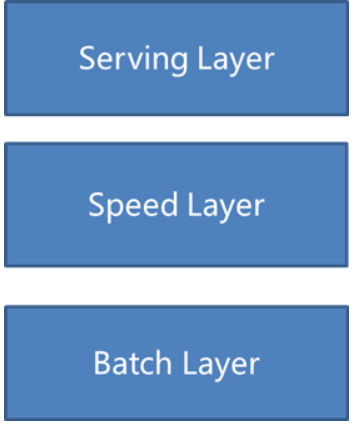

#####题目一： 分析一条 TPCDS SQL（请基于 Spark 3.1.1 版本解答）
SQL 从中任意选择一条：
https://github.com/apache/spark/tree/master/sql/core/src/test/resources/tpcds
（1）运行该 SQL，如 q38，并截图该 SQL 的 SQL 执行图
（2）该 SQL 用到了哪些优化规则（optimizer rules）
（3）请各用不少于 200 字描述其中的两条优化规则
帮助文档：如何运行该 SQL：
1. 从 github 下载 TPCDS 数据生成器
>git clone https://github.com/maropu/spark-tpcds-datagen.git
>cd spark-tpcds-datagen
2. 下载 Spark3.1.1 到 spark-tpcds-datagen 目录并解压
>wget https://archive.apache.org/dist/spark/spark-3.1.1/spark-3.1.1-bin-hadoop2.7.tgz
>tar -zxvf spark-3.1.1-bin-hadoop2.7.tgz
3. 生成数据
>mkdir -p tpcds-data-1g
>export SPARK_HOME=./spark-3.1.1-bin-hadoop2.7
>./bin/dsdgen --output-location tpcds-data-1g
4. 下载三个 test jar 并放到当前目录
>wget
https://repo1.maven.org/maven2/org/apache/spark/spark-catalyst_2.12/3.1.1/spark-catalyst_2.1
2-3.1.1-tests.jar
>wget
https://repo1.maven.org/maven2/org/apache/spark/spark-core_2.12/3.1.1/spark-core_2.12-3.1.1-
tests.jar
>wget
https://repo1.maven.org/maven2/org/apache/spark/spark-sql_2.12/3.1.1/spark-sql_2.12-3.1.1-te
sts.jar
5. 执行 SQL
>./spark-3.1.1-bin-hadoop2.7/bin/spark-submit --class
org.apache.spark.sql.execution.benchmark.TPCDSQueryBenchmark --jars
spark-core_2.12-3.1.1-tests.jar,spark-catalyst_2.12-3.1.1-tests.jar
spark-sql_2.12-3.1.1-tests.jar --data-location tpcds-data-1g --query-filter "q73"

**q73.sql**
```sql
SELECT
  c_last_name,
  c_first_name,
  c_salutation,
  c_preferred_cust_flag,
  ss_ticket_number,
  cnt
FROM
  (SELECT
    ss_ticket_number,
    ss_customer_sk,
    count(*) cnt
  FROM store_sales, date_dim, store, household_demographics
  WHERE store_sales.ss_sold_date_sk = date_dim.d_date_sk
    AND store_sales.ss_store_sk = store.s_store_sk
    AND store_sales.ss_hdemo_sk = household_demographics.hd_demo_sk
    AND date_dim.d_dom BETWEEN 1 AND 2
    AND (household_demographics.hd_buy_potential = '>10000' OR
    household_demographics.hd_buy_potential = 'unknown')
    AND household_demographics.hd_vehicle_count > 0
    AND CASE WHEN household_demographics.hd_vehicle_count > 0
    THEN
      household_demographics.hd_dep_count / household_demographics.hd_vehicle_count
        ELSE NULL END > 1
    AND date_dim.d_year IN (1999, 1999 + 1, 1999 + 2)
    AND store.s_county IN ('Williamson County', 'Franklin Parish', 'Bronx County', 'Orange County')
  GROUP BY ss_ticket_number, ss_customer_sk) dj, customer
WHERE ss_customer_sk = c_customer_sk
  AND cnt BETWEEN 1 AND 5
ORDER BY cnt DESC
```

(1)SQL 执行图:


(2)该 SQL 用到了哪些优化规则（optimizer rules）
优化规则:
- ReorderJoin Join顺序优化
- PushDownPredicates：谓词下推
- ColumnPruning：列裁剪
- NullPropagation：Null 提取
- ConstantFolding：常数折叠
- InferFiltersFromConstraints 约束条件提取
- RewritePredicateSubquery 依赖子查询重写

1.PushDownPredicates:
```text
=== Applying Rule org.apache.spark.sql.catalyst.optimizer.PushDownPredicates ===
OverwriteByExpression RelationV2[] noop-table, true, true                                                                                                                                                                                                                                                                                                                                                                                                                                                                
+- Sort [cnt#1828L DESC NULLS LAST], true                                                                                                                                                                                                                                                                                                                                                                                                                                                                                
+- Project [c_last_name#163, c_first_name#162, c_salutation#161, c_preferred_cust_flag#164, ss_ticket_number#1163, cnt#1828L]                                                                                                                                                                                                                                                                                                                                                                                            
!      +- Filter ((ss_customer_sk#1157 = c_customer_sk#154) AND ((cnt#1828L >= cast(1 as bigint)) AND (cnt#1828L <= cast(5 as bigint))))                                                                                                                                                                                                                                                                                                                                                                                 
!         +- Join Inner                                                                                                                                                                                                                                                                                                                                                                                                                                                                                                  
!            :- Aggregate [ss_ticket_number#1163, ss_customer_sk#1157], [ss_ticket_number#1163, ss_customer_sk#1157, count(1) AS cnt#1828L]                                                                                                                                                                                                                                                                                                                                                                              
!            :  +- Join Inner, ((((ss_hdemo_sk#1159 = hd_demo_sk#446) AND ((hd_buy_potential#448 = >10000) OR (hd_buy_potential#448 = unknown))) AND (hd_vehicle_count#450 > 0)) AND (CASE WHEN (hd_vehicle_count#450 > 0) THEN (cast(hd_dep_count#449 as double) / cast(hd_vehicle_count#450 as double)) ELSE cast(null as double) END > cast(1 as double)))                                                                                                                                                            
!            :     :- Join Inner, ((ss_store_sk#1161 = s_store_sk#666) AND s_county#689 IN (Williamson County,Franklin Parish,Bronx County,Orange County))                                                                                                                                                                                                                                                                                                                                                               
!            :     :  :- Join Inner, ((((ss_sold_date_sk#1154 = d_date_sk#329) AND (d_dom#338 >= 1)) AND (d_dom#338 <= 2)) AND d_year#335 IN (1999,(1999 + 1),(1999 + 2)))                                                                                                                                                                                                                                                                                                                                               
!            :     :  :  :- Relation[ss_sold_date_sk#1154,ss_sold_time_sk#1155,ss_item_sk#1156,ss_customer_sk#1157,ss_cdemo_sk#1158,ss_hdemo_sk#1159,ss_addr_sk#1160,ss_store_sk#1161,ss_promo_sk#1162,ss_ticket_number#1163,ss_quantity#1164,ss_wholesale_cost#1165,ss_list_price#1166,ss_sales_price#1167,ss_ext_discount_amt#1168,ss_ext_sales_price#1169,ss_ext_wholesale_cost#1170,ss_ext_list_price#1171,ss_ext_tax#1172,ss_coupon_amt#1173,ss_net_paid#1174,ss_net_paid_inc_tax#1175,ss_net_profit#1176] parquet  
!            :     :  :  +- Relation[d_date_sk#329,d_date_id#330,d_date#331,d_month_seq#332,d_week_seq#333,d_quarter_seq#334,d_year#335,d_dow#336,d_moy#337,d_dom#338,d_qoy#339,d_fy_year#340,d_fy_quarter_seq#341,d_fy_week_seq#342,d_day_name#343,d_quarter_name#344,d_holiday#345,d_weekend#346,d_following_holiday#347,d_first_dom#348,d_last_dom#349,d_same_day_ly#350,d_same_day_lq#351,d_current_day#352,... 4 more fields] parquet                                                                               
!            :     :  +- Relation[s_store_sk#666,s_store_id#667,s_rec_start_date#668,s_rec_end_date#669,s_closed_date_sk#670,s_store_name#671,s_number_employees#672,s_floor_space#673,s_hours#674,s_manager#675,s_market_id#676,s_geography_class#677,s_market_desc#678,s_market_manager#679,s_division_id#680,s_division_name#681,s_company_id#682,s_company_name#683,s_street_number#684,s_street_name#685,s_street_type#686,s_suite_number#687,s_city#688,s_county#689,... 5 more fields] parquet                    
!            :     +- Relation[hd_demo_sk#446,hd_income_band_sk#447,hd_buy_potential#448,hd_dep_count#449,hd_vehicle_count#450] parquet                                                                                                                                                                                                                                                                                                                                                                                  
!            +- Relation[c_customer_sk#154,c_customer_id#155,c_current_cdemo_sk#156,c_current_hdemo_sk#157,c_current_addr_sk#158,c_first_shipto_date_sk#159,c_first_sales_date_sk#160,c_salutation#161,c_first_name#162,c_last_name#163,c_preferred_cust_flag#164,c_birth_day#165,c_birth_month#166,c_birth_year#167,c_birth_country#168,c_login#169,c_email_address#170,c_last_review_date#171] parquet                                                                                                                 
!                                                                                                                                                                                                                                                                                                                                                                                                                                                                                                                        
!                                                                                                                                                                                                                                                                                                                                                                                                                                                                                                                      
OverwriteByExpression RelationV2[] noop-table, true, true
+- Sort [cnt#1828L DESC NULLS LAST], true
+- Project [c_last_name#163, c_first_name#162, c_salutation#161, c_preferred_cust_flag#164, ss_ticket_number#1163, cnt#1828L]
+- Join Inner, (ss_customer_sk#1157 = c_customer_sk#154)
:- Filter ((cnt#1828L >= cast(1 as bigint)) AND (cnt#1828L <= cast(5 as bigint)))
:  +- Aggregate [ss_ticket_number#1163, ss_customer_sk#1157], [ss_ticket_number#1163, ss_customer_sk#1157, count(1) AS cnt#1828L]
:     +- Join Inner, (ss_hdemo_sk#1159 = hd_demo_sk#446)
:        :- Join Inner, (ss_store_sk#1161 = s_store_sk#666)
:        :  :- Join Inner, (ss_sold_date_sk#1154 = d_date_sk#329)
:        :  :  :- Relation[ss_sold_date_sk#1154,ss_sold_time_sk#1155,ss_item_sk#1156,ss_customer_sk#1157,ss_cdemo_sk#1158,ss_hdemo_sk#1159,ss_addr_sk#1160,ss_store_sk#1161,ss_promo_sk#1162,ss_ticket_number#1163,ss_quantity#1164,ss_wholesale_cost#1165,ss_list_price#1166,ss_sales_price#1167,ss_ext_discount_amt#1168,ss_ext_sales_price#1169,ss_ext_wholesale_cost#1170,ss_ext_list_price#1171,ss_ext_tax#1172,ss_coupon_amt#1173,ss_net_paid#1174,ss_net_paid_inc_tax#1175,ss_net_profit#1176] parquet
:        :  :  +- Filter (((d_dom#338 >= 1) AND (d_dom#338 <= 2)) AND d_year#335 IN (1999,(1999 + 1),(1999 + 2)))
:        :  :     +- Relation[d_date_sk#329,d_date_id#330,d_date#331,d_month_seq#332,d_week_seq#333,d_quarter_seq#334,d_year#335,d_dow#336,d_moy#337,d_dom#338,d_qoy#339,d_fy_year#340,d_fy_quarter_seq#341,d_fy_week_seq#342,d_day_name#343,d_quarter_name#344,d_holiday#345,d_weekend#346,d_following_holiday#347,d_first_dom#348,d_last_dom#349,d_same_day_ly#350,d_same_day_lq#351,d_current_day#352,... 4 more fields] parquet
:        :  +- Filter s_county#689 IN (Williamson County,Franklin Parish,Bronx County,Orange County)
:        :     +- Relation[s_store_sk#666,s_store_id#667,s_rec_start_date#668,s_rec_end_date#669,s_closed_date_sk#670,s_store_name#671,s_number_employees#672,s_floor_space#673,s_hours#674,s_manager#675,s_market_id#676,s_geography_class#677,s_market_desc#678,s_market_manager#679,s_division_id#680,s_division_name#681,s_company_id#682,s_company_name#683,s_street_number#684,s_street_name#685,s_street_type#686,s_suite_number#687,s_city#688,s_county#689,... 5 more fields] parquet
:        +- Filter ((((hd_buy_potential#448 = >10000) OR (hd_buy_potential#448 = unknown)) AND (hd_vehicle_count#450 > 0)) AND (CASE WHEN (hd_vehicle_count#450 > 0) THEN (cast(hd_dep_count#449 as double) / cast(hd_vehicle_count#450 as double)) ELSE cast(null as double) END > cast(1 as double)))
:           +- Relation[hd_demo_sk#446,hd_income_band_sk#447,hd_buy_potential#448,hd_dep_count#449,hd_vehicle_count#450] parquet
+- Relation[c_customer_sk#154,c_customer_id#155,c_current_cdemo_sk#156,c_current_hdemo_sk#157,c_current_addr_sk#158,c_first_shipto_date_sk#159,c_first_sales_date_sk#160,c_salutation#161,c_first_name#162,c_last_name#163,c_preferred_cust_flag#164,c_birth_day#165,c_birth_month#166,c_birth_year#167,c_birth_country#168,c_login#169,c_email_address#170,c_last_review_date#171] parquet
```
**说明**
第一部分
最外部的筛选条件 `WHERE ss_customer_sk = c_customer_sk AND cnt BETWEEN 1 AND 5` 
- `ss_customer_sk = c_customer_sk` 将 `Join Inner` 变成了 `Join Inner, (ss_customer_sk#1157 = c_customer_sk#154)`
- `cnt BETWEEN 1 AND 5` 下推到 Join 之前 `Filter ((cnt#1828L >= cast(1 as bigint)) AND (cnt#1828L <= cast(5 as bigint)))`

第二部分
关联查询 `FROM store_sales, date_dim, store, household_demographics` 的筛选条件 `Filter ((ss_customer_sk#1157 = c_customer_sk#154) AND ((cnt#1828L >= cast(1 as bigint)) AND (cnt#1828L <= cast(5 as bigint))))`
会被提前到各张表 `Join Inner` 之前，变成了先筛选再 Join

2.InferFiltersFromConstraints 约束条件提取
```text
=== Applying Rule org.apache.spark.sql.execution.exchange.EnsureRequirements ===
 OverwriteByExpression org.apache.spark.sql.execution.datasources.noop.NoopTable$@fbb585e, [AlwaysTrue()], [], org.apache.spark.sql.execution.datasources.v2.DataSourceV2Strategy$$Lambda$2938/711254736@1e32a3ed                                                                                                                                                                                                                                                                                                                                                                                                                                                                OverwriteByExpression org.apache.spark.sql.execution.datasources.noop.NoopTable$@fbb585e, [AlwaysTrue()], [], org.apache.spark.sql.execution.datasources.v2.DataSourceV2Strategy$$Lambda$2938/711254736@1e32a3ed
 +- Sort [cnt#1828L DESC NULLS LAST], true, 0                                                                                                                                                                                                                                                                                                                                                                                                                                                                                                                                                                                                                                    +- Sort [cnt#1828L DESC NULLS LAST], true, 0
!   +- Project [c_last_name#163, c_first_name#162, c_salutation#161, c_preferred_cust_flag#164, ss_ticket_number#1163, cnt#1828L]                                                                                                                                                                                                                                                                                                                                                                                                                                                                                                                                                   +- Exchange rangepartitioning(cnt#1828L DESC NULLS LAST, 4), ENSURE_REQUIREMENTS, [id=#772]
!      +- BroadcastHashJoin [ss_customer_sk#1157], [c_customer_sk#154], Inner, BuildRight, false                                                                                                                                                                                                                                                                                                                                                                                                                                                                                                                                                                                       +- Project [c_last_name#163, c_first_name#162, c_salutation#161, c_preferred_cust_flag#164, ss_ticket_number#1163, cnt#1828L]
!         :- Filter ((cnt#1828L >= 1) AND (cnt#1828L <= 5))                                                                                                                                                                                                                                                                                                                                                                                                                                                                                                                                                                                                                               +- BroadcastHashJoin [ss_customer_sk#1157], [c_customer_sk#154], Inner, BuildRight, false
!         :  +- HashAggregate(keys=[ss_ticket_number#1163, ss_customer_sk#1157], functions=[count(1)], output=[ss_ticket_number#1163, ss_customer_sk#1157, cnt#1828L])                                                                                                                                                                                                                                                                                                                                                                                                                                                                                                                       :- Filter ((cnt#1828L >= 1) AND (cnt#1828L <= 5))
!         :     +- HashAggregate(keys=[ss_ticket_number#1163, ss_customer_sk#1157], functions=[partial_count(1)], output=[ss_ticket_number#1163, ss_customer_sk#1157, count#1843L])                                                                                                                                                                                                                                                                                                                                                                                                                                                                                                          :  +- HashAggregate(keys=[ss_ticket_number#1163, ss_customer_sk#1157], functions=[count(1)], output=[ss_ticket_number#1163, ss_customer_sk#1157, cnt#1828L])
!         :        +- Project [ss_customer_sk#1157, ss_ticket_number#1163]                                                                                                                                                                                                                                                                                                                                                                                                                                                                                                                                                                                                                   :     +- Exchange hashpartitioning(ss_ticket_number#1163, ss_customer_sk#1157, 4), ENSURE_REQUIREMENTS, [id=#764]
!         :           +- BroadcastHashJoin [ss_hdemo_sk#1159], [hd_demo_sk#446], Inner, BuildRight, false                                                                                                                                                                                                                                                                                                                                                                                                                                                                                                                                                                                    :        +- HashAggregate(keys=[ss_ticket_number#1163, ss_customer_sk#1157], functions=[partial_count(1)], output=[ss_ticket_number#1163, ss_customer_sk#1157, count#1843L])
!         :              :- Project [ss_customer_sk#1157, ss_hdemo_sk#1159, ss_ticket_number#1163]                                                                                                                                                                                                                                                                                                                                                                                                                                                                                                                                                                                           :           +- Project [ss_customer_sk#1157, ss_ticket_number#1163]
!         :              :  +- BroadcastHashJoin [ss_store_sk#1161], [s_store_sk#666], Inner, BuildRight, false                                                                                                                                                                                                                                                                                                                                                                                                                                                                                                                                                                              :              +- BroadcastHashJoin [ss_hdemo_sk#1159], [hd_demo_sk#446], Inner, BuildRight, false
!         :              :     :- Project [ss_customer_sk#1157, ss_hdemo_sk#1159, ss_store_sk#1161, ss_ticket_number#1163]                                                                                                                                                                                                                                                                                                                                                                                                                                                                                                                                                                   :                 :- Project [ss_customer_sk#1157, ss_hdemo_sk#1159, ss_ticket_number#1163]
!         :              :     :  +- BroadcastHashJoin [ss_sold_date_sk#1154], [d_date_sk#329], Inner, BuildRight, false                                                                                                                                                                                                                                                                                                                                                                                                                                                                                                                                                                     :                 :  +- BroadcastHashJoin [ss_store_sk#1161], [s_store_sk#666], Inner, BuildRight, false
!         :              :     :     :- Filter (((isnotnull(ss_sold_date_sk#1154) AND isnotnull(ss_store_sk#1161)) AND isnotnull(ss_hdemo_sk#1159)) AND isnotnull(ss_customer_sk#1157))                                                                                                                                                                                                                                                                                                                                                                                                                                                                                                      :                 :     :- Project [ss_customer_sk#1157, ss_hdemo_sk#1159, ss_store_sk#1161, ss_ticket_number#1163]
!         :              :     :     :  +- FileScan parquet [ss_sold_date_sk#1154,ss_customer_sk#1157,ss_hdemo_sk#1159,ss_store_sk#1161,ss_ticket_number#1163] Batched: true, DataFilters: [isnotnull(ss_sold_date_sk#1154), isnotnull(ss_store_sk#1161), isnotnull(ss_hdemo_sk#1159), isnot..., Format: Parquet, Location: InMemoryFileIndex[file:/Volumes/storage/logs/bigdata/output/tpcds-data-1g/store_sales], PartitionFilters: [], PushedFilters: [IsNotNull(ss_sold_date_sk), IsNotNull(ss_store_sk), IsNotNull(ss_hdemo_sk), IsNotNull(ss_custome..., ReadSchema: struct<ss_sold_date_sk:int,ss_customer_sk:int,ss_hdemo_sk:int,ss_store_sk:int,ss_ticket_number:int>               :                 :     :  +- BroadcastHashJoin [ss_sold_date_sk#1154], [d_date_sk#329], Inner, BuildRight, false
!         :              :     :     +- Project [d_date_sk#329]                                                                                                                                                                                                                                                                                                                                                                                                                                                                                                                                                                                                                              :                 :     :     :- Filter (((isnotnull(ss_sold_date_sk#1154) AND isnotnull(ss_store_sk#1161)) AND isnotnull(ss_hdemo_sk#1159)) AND isnotnull(ss_customer_sk#1157))
!         :              :     :        +- Filter ((((isnotnull(d_dom#338) AND (d_dom#338 >= 1)) AND (d_dom#338 <= 2)) AND d_year#335 IN (1999,2000,2001)) AND isnotnull(d_date_sk#329))                                                                                                                                                                                                                                                                                                                                                                                                                                                                                                     :                 :     :     :  +- FileScan parquet [ss_sold_date_sk#1154,ss_customer_sk#1157,ss_hdemo_sk#1159,ss_store_sk#1161,ss_ticket_number#1163] Batched: true, DataFilters: [isnotnull(ss_sold_date_sk#1154), isnotnull(ss_store_sk#1161), isnotnull(ss_hdemo_sk#1159), isnot..., Format: Parquet, Location: InMemoryFileIndex[file:/Volumes/storage/logs/bigdata/output/tpcds-data-1g/store_sales], PartitionFilters: [], PushedFilters: [IsNotNull(ss_sold_date_sk), IsNotNull(ss_store_sk), IsNotNull(ss_hdemo_sk), IsNotNull(ss_custome..., ReadSchema: struct<ss_sold_date_sk:int,ss_customer_sk:int,ss_hdemo_sk:int,ss_store_sk:int,ss_ticket_number:int>
!         :              :     :           +- FileScan parquet [d_date_sk#329,d_year#335,d_dom#338] Batched: true, DataFilters: [isnotnull(d_dom#338), (d_dom#338 >= 1), (d_dom#338 <= 2), d_year#335 IN (1999,2000,2001), isnotn..., Format: Parquet, Location: InMemoryFileIndex[file:/Volumes/storage/logs/bigdata/output/tpcds-data-1g/date_dim], PartitionFilters: [], PushedFilters: [IsNotNull(d_dom), GreaterThanOrEqual(d_dom,1), LessThanOrEqual(d_dom,2), In(d_year, [1999,2000,2..., ReadSchema: struct<d_date_sk:int,d_year:int,d_dom:int>                                                                                                                                      :                 :     :     +- BroadcastExchange HashedRelationBroadcastMode(List(cast(input[0, int, true] as bigint)),false), [id=#751]
!         :              :     +- Project [s_store_sk#666]                                                                                                                                                                                                                                                                                                                                                                                                                                                                                                                                                                                                                                   :                 :     :        +- Project [d_date_sk#329]
!         :              :        +- Filter (s_county#689 IN (Williamson County,Franklin Parish,Bronx County,Orange County) AND isnotnull(s_store_sk#666))                                                                                                                                                                                                                                                                                                                                                                                                                                                                                                                                   :                 :     :           +- Filter ((((isnotnull(d_dom#338) AND (d_dom#338 >= 1)) AND (d_dom#338 <= 2)) AND d_year#335 IN (1999,2000,2001)) AND isnotnull(d_date_sk#329))
!         :              :           +- FileScan parquet [s_store_sk#666,s_county#689] Batched: true, DataFilters: [s_county#689 IN (Williamson County,Franklin Parish,Bronx County,Orange County), isnotnull(s_stor..., Format: Parquet, Location: InMemoryFileIndex[file:/Volumes/storage/logs/bigdata/output/tpcds-data-1g/store], PartitionFilters: [], PushedFilters: [In(s_county, [Williamson County,Franklin Parish,Bronx County,Orange County]), IsNotNull(s_store_..., ReadSchema: struct<s_store_sk:int,s_county:string>                                                                                                                                                          :                 :     :              +- FileScan parquet [d_date_sk#329,d_year#335,d_dom#338] Batched: true, DataFilters: [isnotnull(d_dom#338), (d_dom#338 >= 1), (d_dom#338 <= 2), d_year#335 IN (1999,2000,2001), isnotn..., Format: Parquet, Location: InMemoryFileIndex[file:/Volumes/storage/logs/bigdata/output/tpcds-data-1g/date_dim], PartitionFilters: [], PushedFilters: [IsNotNull(d_dom), GreaterThanOrEqual(d_dom,1), LessThanOrEqual(d_dom,2), In(d_year, [1999,2000,2..., ReadSchema: struct<d_date_sk:int,d_year:int,d_dom:int>
!         :              +- Project [hd_demo_sk#446]                                                                                                                                                                                                                                                                                                                                                                                                                                                                                                                                                                                                                                         :                 :     +- BroadcastExchange HashedRelationBroadcastMode(List(cast(input[0, int, true] as bigint)),false), [id=#755]
!         :                 +- Filter ((((isnotnull(hd_vehicle_count#450) AND ((hd_buy_potential#448 = >10000) OR (hd_buy_potential#448 = unknown))) AND (hd_vehicle_count#450 > 0)) AND (CASE WHEN (hd_vehicle_count#450 > 0) THEN (cast(hd_dep_count#449 as double) / cast(hd_vehicle_count#450 as double)) ELSE null END > 1.0)) AND isnotnull(hd_demo_sk#446))                                                                                                                                                                                                                                                                                                                           :                 :        +- Project [s_store_sk#666]
!         :                    +- FileScan parquet [hd_demo_sk#446,hd_buy_potential#448,hd_dep_count#449,hd_vehicle_count#450] Batched: true, DataFilters: [isnotnull(hd_vehicle_count#450), ((hd_buy_potential#448 = >10000) OR (hd_buy_potential#448 = unk..., Format: Parquet, Location: InMemoryFileIndex[file:/Volumes/storage/logs/bigdata/output/tpcds-data-1g/household_demographics], PartitionFilters: [], PushedFilters: [IsNotNull(hd_vehicle_count), Or(EqualTo(hd_buy_potential,>10000),EqualTo(hd_buy_potential,unknow..., ReadSchema: struct<hd_demo_sk:int,hd_buy_potential:string,hd_dep_count:int,hd_vehicle_count:int>                                                   :                 :           +- Filter (s_county#689 IN (Williamson County,Franklin Parish,Bronx County,Orange County) AND isnotnull(s_store_sk#666))
!         +- Filter isnotnull(c_customer_sk#154)                                                                                                                                                                                                                                                                                                                                                                                                                                                                                                                                                                                                                                             :                 :              +- FileScan parquet [s_store_sk#666,s_county#689] Batched: true, DataFilters: [s_county#689 IN (Williamson County,Franklin Parish,Bronx County,Orange County), isnotnull(s_stor..., Format: Parquet, Location: InMemoryFileIndex[file:/Volumes/storage/logs/bigdata/output/tpcds-data-1g/store], PartitionFilters: [], PushedFilters: [In(s_county, [Williamson County,Franklin Parish,Bronx County,Orange County]), IsNotNull(s_store_..., ReadSchema: struct<s_store_sk:int,s_county:string>
!            +- FileScan parquet [c_customer_sk#154,c_salutation#161,c_first_name#162,c_last_name#163,c_preferred_cust_flag#164] Batched: true, DataFilters: [isnotnull(c_customer_sk#154)], Format: Parquet, Location: InMemoryFileIndex[file:/Volumes/storage/logs/bigdata/output/tpcds-data-1g/customer], PartitionFilters: [], PushedFilters: [IsNotNull(c_customer_sk)], ReadSchema: struct<c_customer_sk:int,c_salutation:string,c_first_name:string,c_last_name:string,c_preferred_c...                                                                                                                                                                                               :                 +- BroadcastExchange HashedRelationBroadcastMode(List(cast(input[0, int, true] as bigint)),false), [id=#759]
!                                                                                                                                                                                                                                                                                                                                                                                                                                                                                                                                                                                                                                                                                            :                    +- Project [hd_demo_sk#446]
!                                                                                                                                                                                                                                                                                                                                                                                                                                                                                                                                                                                                                                                                                            :                       +- Filter ((((isnotnull(hd_vehicle_count#450) AND ((hd_buy_potential#448 = >10000) OR (hd_buy_potential#448 = unknown))) AND (hd_vehicle_count#450 > 0)) AND (CASE WHEN (hd_vehicle_count#450 > 0) THEN (cast(hd_dep_count#449 as double) / cast(hd_vehicle_count#450 as double)) ELSE null END > 1.0)) AND isnotnull(hd_demo_sk#446))
!                                                                                                                                                                                                                                                                                                                                                                                                                                                                                                                                                                                                                                                                                            :                          +- FileScan parquet [hd_demo_sk#446,hd_buy_potential#448,hd_dep_count#449,hd_vehicle_count#450] Batched: true, DataFilters: [isnotnull(hd_vehicle_count#450), ((hd_buy_potential#448 = >10000) OR (hd_buy_potential#448 = unk..., Format: Parquet, Location: InMemoryFileIndex[file:/Volumes/storage/logs/bigdata/output/tpcds-data-1g/household_demographics], PartitionFilters: [], PushedFilters: [IsNotNull(hd_vehicle_count), Or(EqualTo(hd_buy_potential,>10000),EqualTo(hd_buy_potential,unknow..., ReadSchema: struct<hd_demo_sk:int,hd_buy_potential:string,hd_dep_count:int,hd_vehicle_count:int>
!                                                                                                                                                                                                                                                                                                                                                                                                                                                                                                                                                                                                                                                                                            +- BroadcastExchange HashedRelationBroadcastMode(List(cast(input[0, int, false] as bigint)),false), [id=#768]
!                                                                                                                                                                                                                                                                                                                                                                                                                                                                                                                                                                                                                                                                                               +- Filter isnotnull(c_customer_sk#154)
!                                                                                                                                                                                                                                                                                                                                                                                                                                                                                                                                                                                                                                                                                                  +- FileScan parquet [c_customer_sk#154,c_salutation#161,c_first_name#162,c_last_name#163,c_preferred_cust_flag#164] Batched: true, DataFilters: [isnotnull(c_customer_sk#154)], Format: Parquet, Location: InMemoryFileIndex[file:/Volumes/storage/logs/bigdata/output/tpcds-data-1g/customer], PartitionFilters: [], PushedFilters: [IsNotNull(c_customer_sk)], ReadSchema: struct<c_customer_sk:int,c_salutation:string,c_first_name:string,c_last_name:string,c_preferred_c...
```
                                                                                                                                                                                                                                                                                                                                                                                                                                                                                                                                                                                                                                                                                                                                                                                                                                                                                                                                                                +- Relation[ss_sold_date_sk#1154,ss_sold_time_sk#1155,ss_item_sk#1156,ss_customer_sk#1157,ss_cdemo_sk#1158,ss_hdemo_sk#1159,ss_addr_sk#1160,ss_store_sk#1161,ss_promo_sk#1162,ss_ticket_number#1163,ss_quantity#1164,ss_wholesale_cost#1165,ss_list_price#1166,ss_sales_price#1167,ss_ext_discount_amt#1168,ss_ext_sales_price#1169,ss_ext_wholesale_cost#1170,ss_ext_list_price#1171,ss_ext_tax#1172,ss_coupon_amt#1173,ss_net_paid#1174,ss_net_paid_inc_tax#1175,ss_net_profit#1176] parquet

#####题目二：架构设计题
你是某互联网公司的大数据平台架构师，请设计一套基于 Lambda 架构的数据平台架构，要
求尽可能多的把课程中涉及的组件添加到该架构图中。并描述 Lambda 架构的优缺点，要求
不少于 300 字。




数据流存储可选用基于不可变日志的分布式消息系统Kafka；
Batch Layer数据集的存储可选用Hadoop的HDFS，或者是阿里云的ODPS；
Batch View的预计算可以选用MapReduce或Spark；
Batch View自身结果数据的存储可使用MySQL（查询少量的最近结果数据），或HBase（查询大量的历史结果数据）。
Speed Layer增量数据的处理可选用Storm或Spark Streaming；
Realtime View增量结果数据集为了满足实时更新的效率，可选用Redis等内存NoSQL。


#####题目三：简答题（三选一）
A：简述 HDFS 的读写流程，要求不少于 300 字

1. 客户端通过 RPC 调用 NameNode 的 NameNodeRpcServer
2. NameNode 回将最近的元数据更新到内存，磁盘和 JournalNode
    1. 更新内存：更新元数据到 FSDirectory
    2. 更新磁盘：EditLog 写入到本地磁盘
    3. 更新 JournalNode：EditLog 发送给 JournalNode
3. JournalNode 把 EditLog 通过 Http 发送给 SecondNameNode
4. SecondNameNode 定时合并 EditLog 为 FsImage, 并更新到 NameNode

B：简述 Spark Shuffle 的工作原理，要求不少于 300 字
C：简述 Flink SQL 的工作原理，要求不少于 300 字